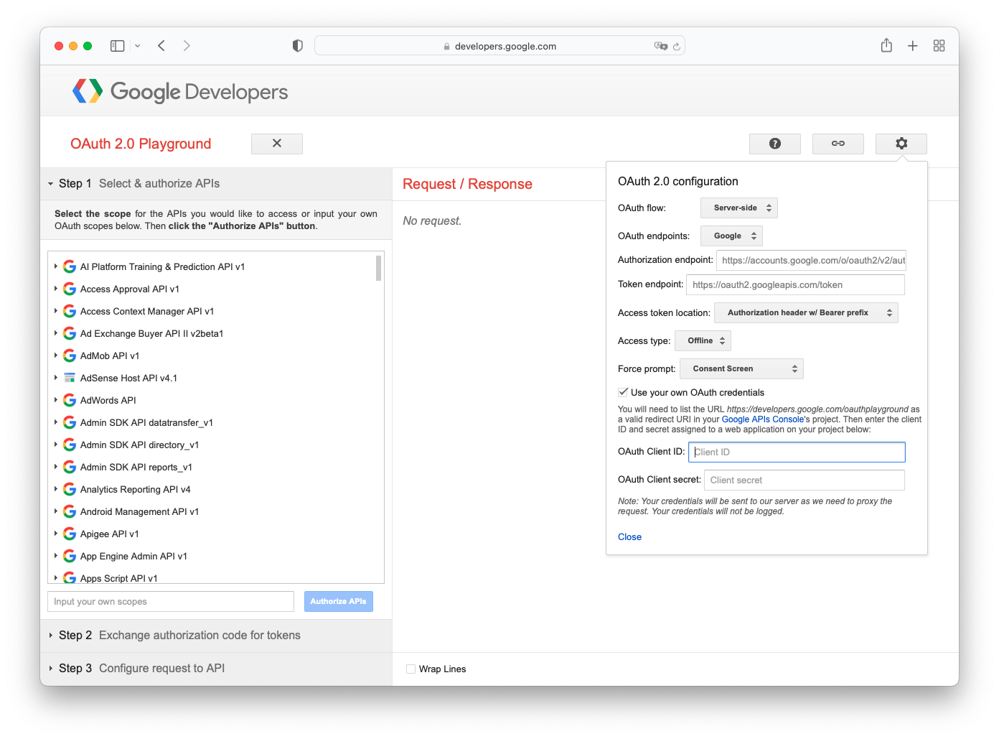
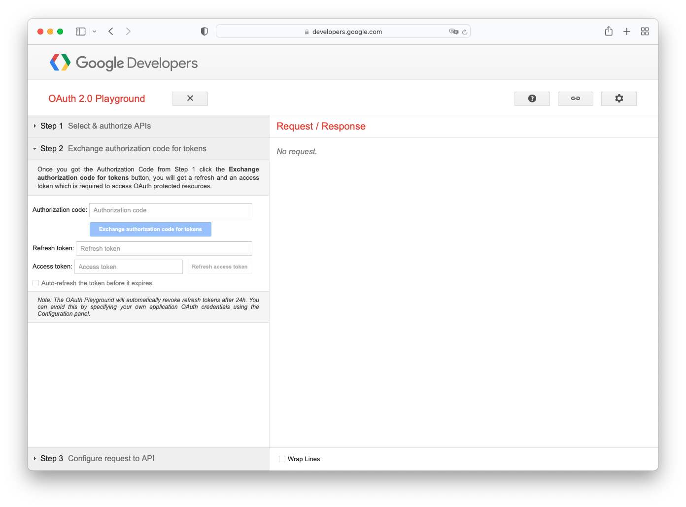

# Action IT - Form Trello Integration

## 1. Google Forms API

This repository integrates the [Google Forms API (Beta)](https://developers.google.com/forms) to set up and receive push notifications and retrieve responses from the Action IT application form.

Google Forms API is currently in Open Beta, and to use the API, you need to apply for access at the [Early Adopter Program](https://developers.google.com/forms/api/eap) page. Your Google Cloud project must be allowlisted first before using the API.

## 2. Trello REST API

Trello is used for storing the applicant details and integrated with Zapier to trigger email notifications when applicant status changes (e.g Accepted, Rejected, Pending Technical Test, Pending Interview, etc.). [Trello REST API](https://developer.atlassian.com/cloud/trello/rest/) is integrated to automatically create new cards on the "New Applicant" list and assign values to the [Custom Fields](https://help.trello.com/article/1067-using-custom-fields) with the data received from the form response.

# System Overview

## 1. Google OAuth 2.0

Use the [Google OAuth 2.0 Playground](https://developers.google.com/oauthplayground/) to generate `access_token` and `refresh_token` for the server-side access. Please provide your OAuth Client ID & OAuth Client Secret before authorizing APIs.



In the "Input your own scopes" input field, please enter `https://www.googleapis.com/auth/drive,https://www.googleapis.com/auth/drive.file,https://www.googleapis.com/auth/forms.responses.readonly` and click **Authorize APIs**.

An Authorization Code will be generated for you. Please click **Exchange authorization code for tokens** to get your `access_token` and `refresh_token`.



Store the credentials in a secure location for future Forms API calls.

## 2. Google Form Watch

Create a Form Response Watch with the `watches.create` method from the Google Forms API. Please create a [Pub/Sub Topic](https://cloud.google.com/pubsub/docs/quickstart-console#create_a_topic) in your Google Cloud Project before creating the watch.

```TS
async function createWatch(query) {
  const authClient = await getOAuthClient();
  const forms = googleForms.forms({
    version: "v1beta",
    auth: authClient,
  });

  const newWatch = {
    watch: {
      target: {
        topic: {
          topicName: "GCP_PUB/SUB_TOPIC",
        },
      },
      eventType: "RESPONSES",
    },
  };

  const res = await forms.forms.watches.create({
    formId: formID,
    requestBody: newWatch,
  });

  return res.data;
}
```

## 3. Renew Watch

By default, the form watch expires after 7 days, and you need to renew the watch before it expires. The [`renewFormWatch`](./functions/src/renewFormWatch.ts) Firebase Function handles the renew logic for the system.

## 4. Fetch Form Responses

Whenever there is a new form response received, the form watch will be triggered and thus publish the message to the Pub/Sub Topic you created. The form notification payload does not contain the form answers. Hence, we need to fetch the form responses via a separate call.

The `lastFetchTime` is stored in Firestore and updated after each fetch to make sure we won't create duplicate cards for each applicant.

```TS
async function retrieveFormResponese(lastFetchTime: string, formId: string) {
  const authClient = await getOAuthClient();
  const forms = googleForms.forms({
    version: 'v1beta',
    auth: authClient,
  });

  const res = await forms.forms.responses.list({
    formId: formId,
    filter: `timestamp >= ${lastFetchTime}`,
  });

  return res.data;
}
```

## 5. Create Trello Cards

[`formTrelloMap`](./functions/src/utils/formTrelloMap.ts) defines the mapping relationship between Google Form answer keys with the Trello Custom Field IDs. The `formResponses` Firebase Function will use the `formTrelloMap` to find out which form answer needs to be set to the corresponding Trello Custom Field. More information can be found under [`formResponses.ts`](./functions/src/formResponses.ts)
